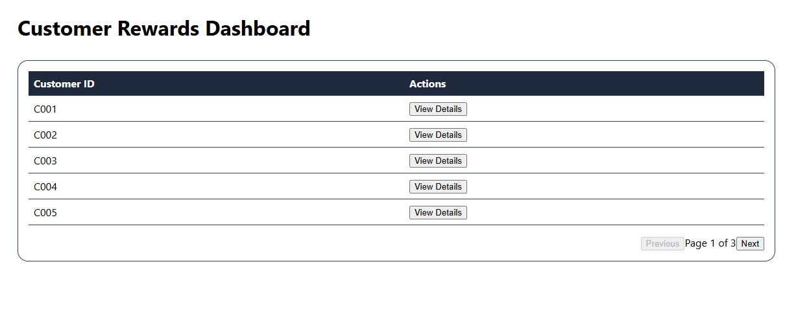

## Project Documentation

### Project Setup

1. **Clone the repository:**
    ```bash
    git clone https://github.com/your-username/rewards-app.git
    cd rewards-app
    ```
2. **Install dependencies:**
    ```bash
    npm install
    ```
3. **Configure environment variables:**
    - Create a `.env` file if required and add necessary configuration.

### How to Run the Application

- **Start the development server:**
  ```bash
  npm start
  ```
- The application will be available at `http://localhost:3000`.

### Component Details

- **CustomerLsit:** Displays the list of customers.
- **CustomerDetails:** Shows detailed information for a selected customer transactions.

### Working Screenshots

Below are screenshots demonstrating the application in action:




### Success Screenshots of Test Cases

- After running tests, successful test case screenshots can be found in the `/screenshots` directory.

---

For more details, refer to the inline comments in the source code.


